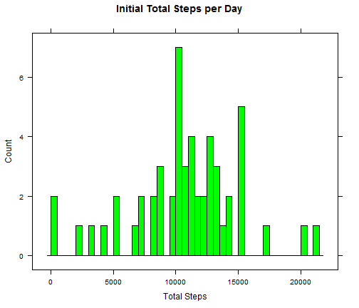
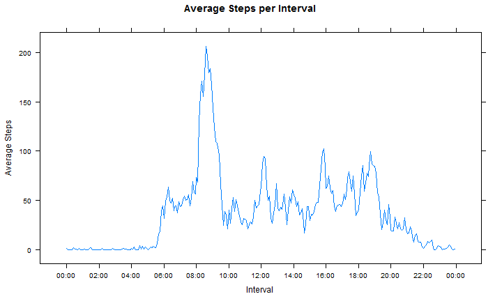
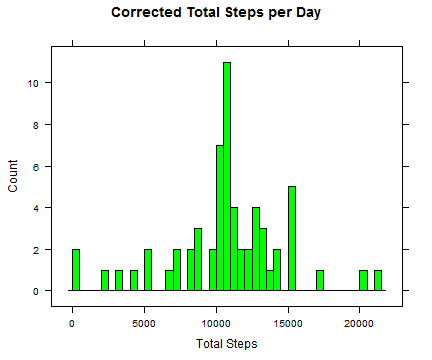
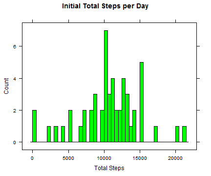
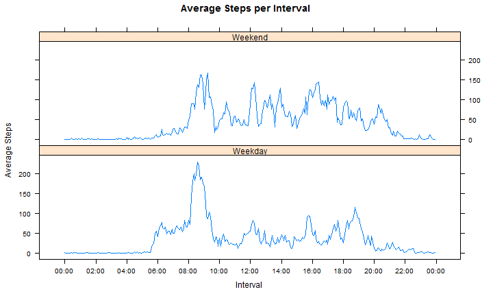

# Coursera Reproducible Research Assignment 1

## Step 1

Before doing anything we need to load the necessary library functions, the data and format it appropriately. I assume the data is in the working directory, in a folder called "activity":


```r
library(lattice)
options(scipen = 20)

filepath <- getwd()
file <- paste(filepath, "/activity/activity.csv", sep = "")
data <- read.csv(file, header = TRUE)

data$date <- as.Date(data$date)
data$interval <- factor(data$interval)
```


## Step 2

We need to plot a Histogram of the total steps per day, and cacluate the mean and median. The following code is used:


```r
## Calculation of the total steps per day
dailytotal <- aggregate(steps ~ date, data, sum)
## create graph
graph1 <- histogram(dailytotal$steps, col = "green", breaks = 50, xlab = "Total Steps", 
    main = "Initial Total Steps per Day", type = "count")
## calculate required outputs
dailytotalmean <- mean(dailytotal$steps)
dailytotalmedian <- median(dailytotal$steps)
```


Which gives us a graph of:

 


And we get the results
- Mean: 10766.1887
- Median: 10765


## Step 3 

Next we need to calculate mean of the steps per interval, plot a line graph and calculate which interval has the maximum number of steps on average.


```r
## Calculation of the mean steps per interval
intervalmean <- aggregate(steps ~ interval, data, mean)
## next conversion of formats
intervalmean$interval <- as.numeric(levels(intervalmean$interval))[intervalmean$interval]
intervalmean$interval <- strptime(sprintf("%04d", intervalmean$interval), "%H%M")
## create the graph
graph2 <- xyplot(steps ~ as.POSIXct(interval), data = intervalmean, type = "l", 
    xlab = "Interval", ylab = "Average Steps", main = "Average Steps per Interval", 
    scales = list(x = list(at = seq(as.POSIXct(intervalmean$interval[1]), by = "2 hour", 
        length = 13), labels = format(seq(as.POSIXct(intervalmean$interval[1]), 
        by = "2 hour", length = 13), "%H:%M"))))
## calculate the interval with the maximum average steps
maxinterval <- format(intervalmean[which.max(intervalmean$step), "interval"], 
    "%H:%M")
```


This gives us the following graph:

 


Not easy to see in the graph, but the interval with the maximum number of steps on average is interval: 08:35


## Step 4 

After this we need to calculate number of missing data fields, and replace missing values. I chose to replace each interval with the mean for that interval from the rest of the data. 

```r
## Create a new data set, and also find out where and how many NA values
## there are
data2 <- data
dataNA <- is.na(data2$steps)
datamissing <- sum(dataNA)
## Replace NA values with the mean for that interval
data2[dataNA, "steps"] <- intervalmean[data2[dataNA, "interval"], "steps"]
## Recalculate the mean, median and plot the required graph
newdailytotal <- aggregate(steps ~ date, data2, sum)
newdailytotalmean <- mean(newdailytotal$steps)
newdailytotalmedian <- median(newdailytotal$steps)
graph3 <- histogram(newdailytotal$steps, col = "green", breaks = 50, xlab = "Total Steps", 
    main = "Corrected Total Steps per Day", type = "count")
```


We had 2304 missing data points. When corrected, for comparison gives us:

  


And we can see that the changes to the mean and median are zero:
- Original Mean: 10766.1887
- New Mean: 10766.1887
- Original Median: 10765
- New Median: 10765


## Step 5 

Finally we look to see if the Weekend v Weekday split shows any difference. 

```r
## Create a column for Weekend/Weekday
weekend <- as.factor(ifelse(weekdays(data2$date) %in% c("Saturday", "Sunday"), 
    "Weekend", "Weekday"))
newdata <- cbind(data2, weekend)
## Create the mean, but include the weekend split, and plot graph.
newintervalmean <- aggregate(steps ~ interval + weekend, newdata, mean)
newintervalmean$interval <- as.numeric(levels(newintervalmean$interval))[newintervalmean$interval]
newintervalmean$interval <- strptime(sprintf("%04d", newintervalmean$interval), 
    "%H%M")
graph4 <- xyplot(steps ~ as.POSIXct(interval) | weekend, data = newintervalmean, 
    type = "l", layout = c(1, 2), xlab = "Interval", ylab = "Average Steps", 
    main = "Average Steps per Interval", scales = list(x = list(at = seq(as.POSIXct(newintervalmean$interval[1]), 
        by = "2 hour", length = 13), labels = format(seq(as.POSIXct(newintervalmean$interval[1]), 
        by = "2 hour", length = 13), "%H:%M"))))
```


This gives us the following graph:

 


From which we can clearly see there is a difference between the weekend and weekday step patterns. 
